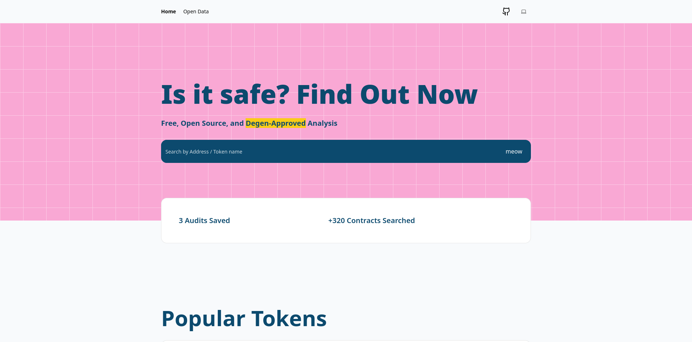

# Degen Analysis

Degen Analysis is a web app that allows you to analyze smart contracts. The goal is to allow the user to know if a smart contract is reliable or not.

## Statut
⚠️ This project is under development and is not yet finished. Some features may be missing or unstable.

## Installation


```bash
  git clone https://github.com/imbjdd/degenanalysis
  cd degenanalysis
  npm install
  npm run dev
```
    
## Screenshots




## License

[MIT](https://choosealicense.com/licenses/mit/)
